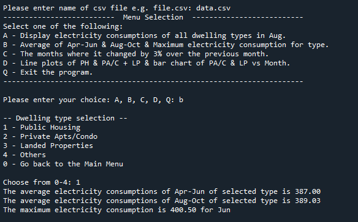
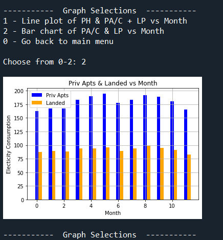

# Singapore Electricity Consumption Analysis

## Overview

This project involves analyzing monthly electricity consumption data in Singapore for various dwelling types in the year 2019. The goal is to provide insights and visualizations based on user input and requirements. The project does not use pandas but may utilize other Python libraries/modules as needed.

## Project Description

In this project, we are tasked with analyzing and presenting monthly electricity consumption data for different dwelling types in Singapore. The data is available in CSV formats. The project involves the following tasks:

- Initialize appropriate lists with the full data.
- Create a menu-driven program with four different options:
  - Display the monthly electricity consumptions of all dwelling types in August.
  - Calculate and display statistics for the user's selected dwelling type, including the average electricity consumption in specified 3-month periods and the maximum consumption within those periods.
  - Identify and display months where the monthly electricity consumption has changed by at least 3% compared to the previous month for the selected dwelling type.
  - Generate electricity consumption plots with appropriate labels.
- Implement menu-driven functionality based on the user's selection.

## Key Objectives

The project's main objectives are as follows:

- Process and analyze electricity consumption data for different dwelling types.
- Provide meaningful statistics and insights to the user.
- Create plots to visualize the data effectively.
- Implement user-friendly menu options for interaction.

## Software Features

The software features of the project include:

- Data processing and manipulation.
- Calculation of statistics, such as averages and maximum values.
- Plotting data using Python libraries.

### Program Visuals

#### Data Info

#### Menu1(function 1)

#### Menu2(function 2)

#### Menu3(function 3)

#### Plot1(function 4)

#### Plot2(function 4)

